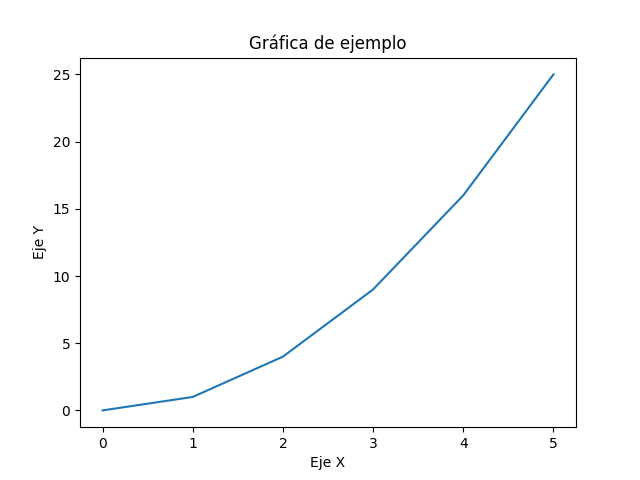

# Introduction

This assignment focuses on **[briefly describe the topic of your assignment]**. The purpose of this work is to **[explain the objective or goal of your assignment]**. Through this study, we aim to **[mention the outcome or insights you're expecting]**.

The following sections will cover **[mention the main points or structure of your assignment]**.

## Objective

- **Objective 1**: [Description]
- **Objective 2**: [Description]
- **Objective 3**: [Description]

## Conclusion

This assignment will provide an in-depth understanding of **[topic or technology]**. We aim to complete the project successfully by applying the concepts learned.

# Introducción

Este es un ejemplo de documento en Markdown. A continuación se muestra una gráfica generada con Python.

## Gráfica de ejemplo

Como se puede observar, la gráfica muestra la relación entre los valores de `x` y `y`, donde los valores de `y` son los cuadrados de `x`.

## Conclusión

Este es un ejemplo simple de cómo generar y mostrar gráficos en un documento Markdown utilizando Python.
